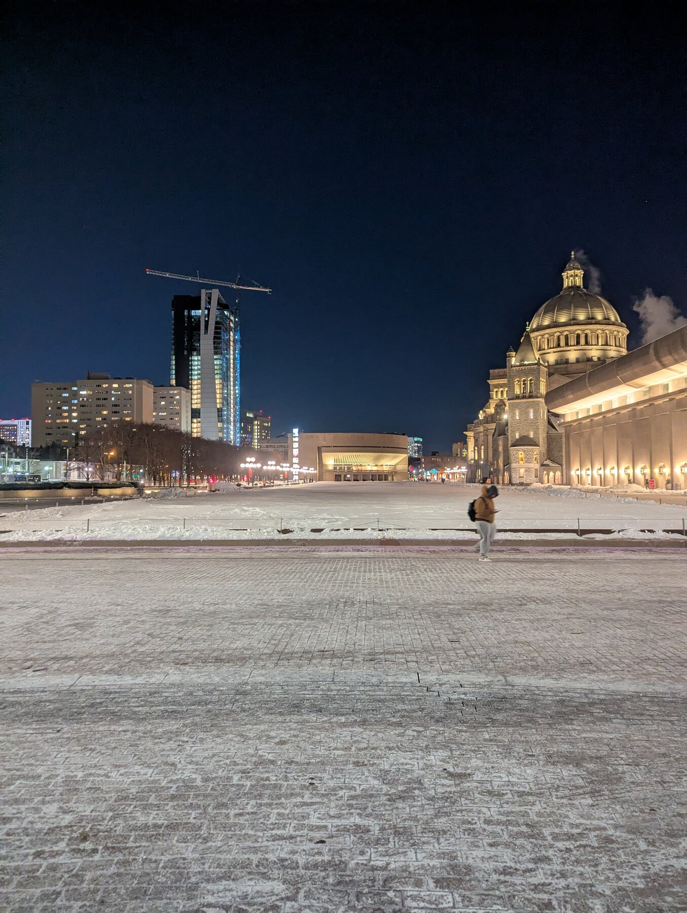
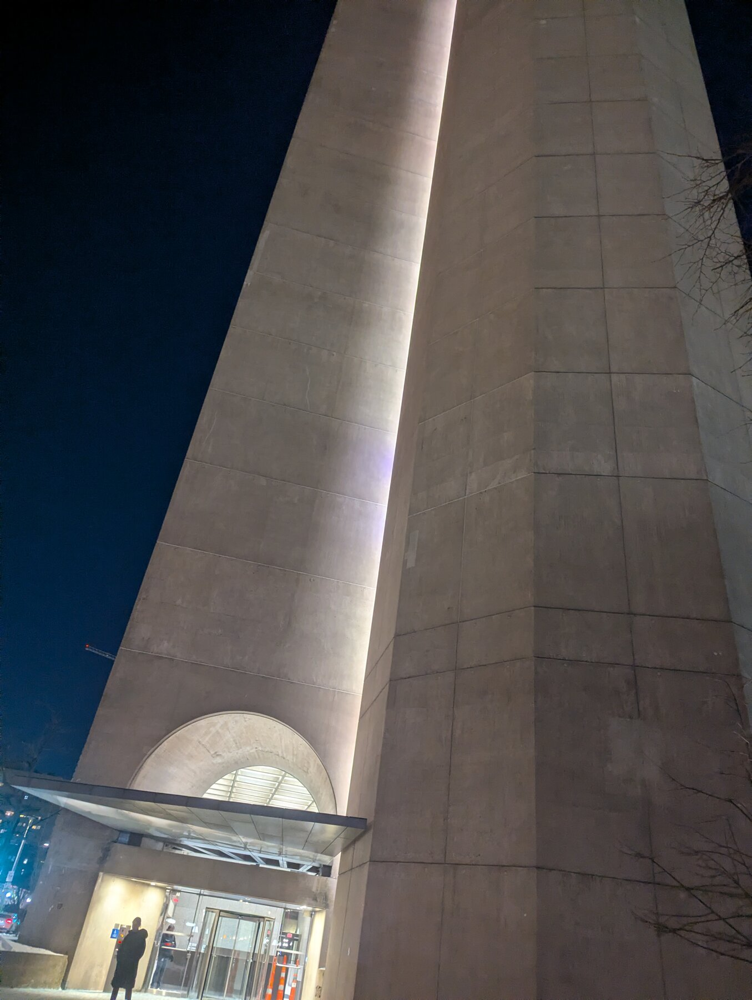
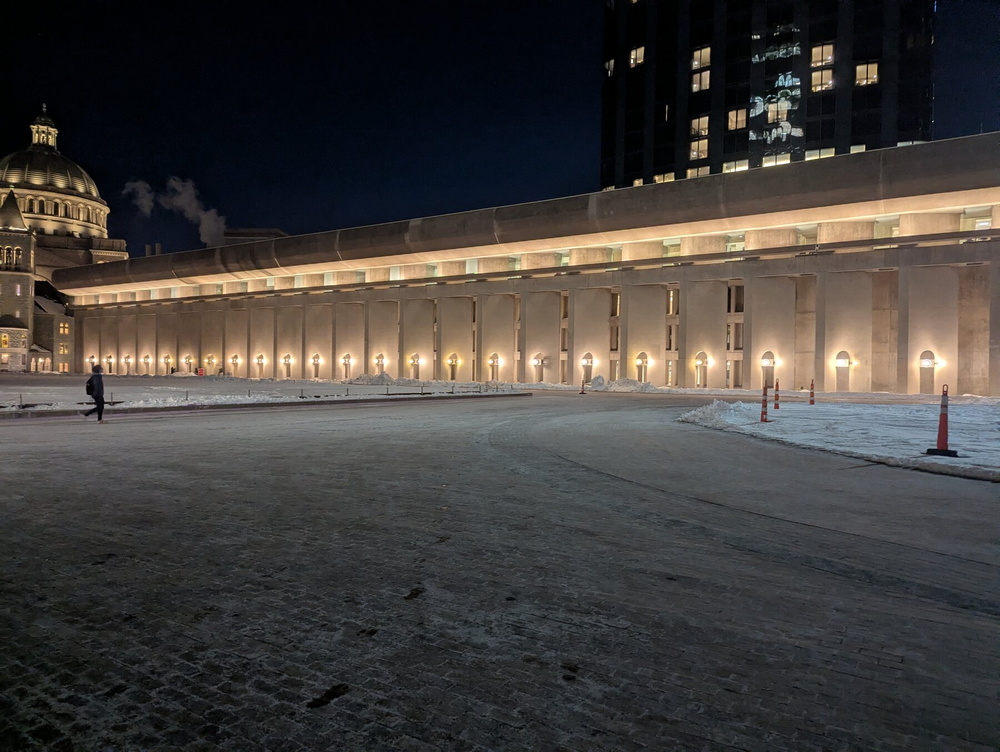
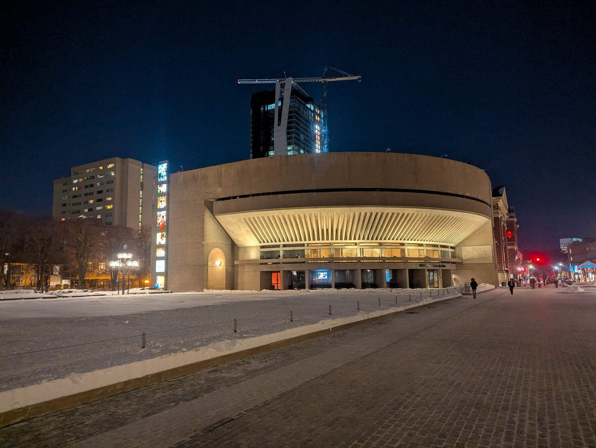
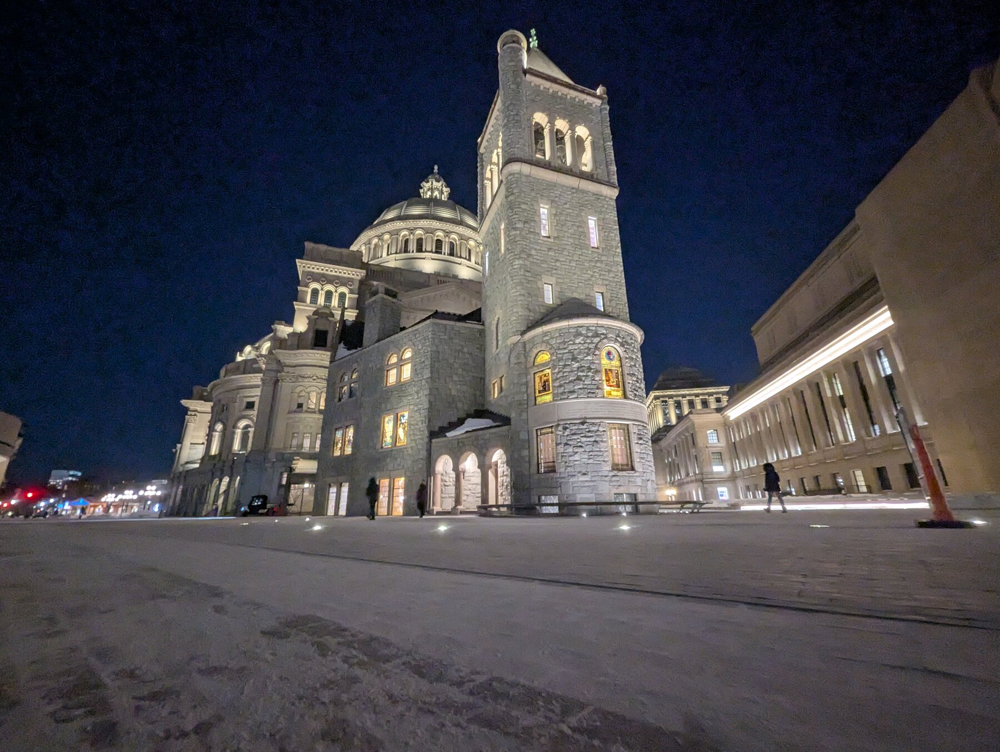
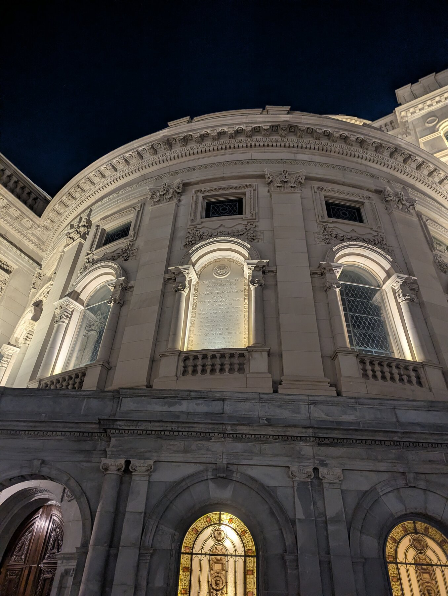
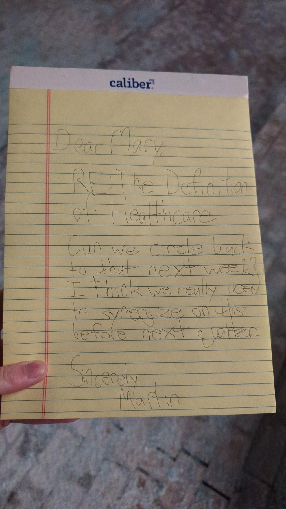
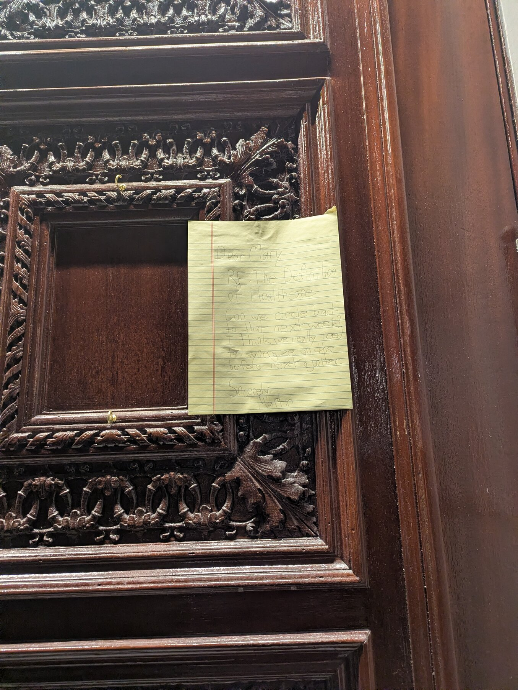
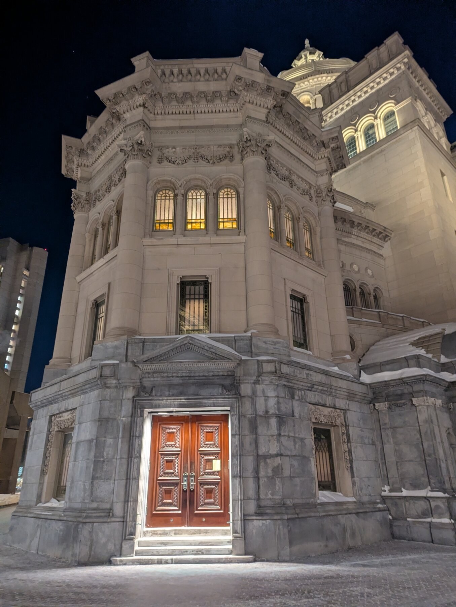

+++
title = "The Christian Science Plaza"
date = 2026-01-29

[extra]
cover = "PXL_20260130_002706712.jpg"
+++
_medium_: legal pad paper, pen, tape, the mother church of christian science

I've always found the Christian Science Plaza to be kind of a corporate,
brutalist monstrosity, so I was kind of surprised to learn that it had an
entry in Boston's POPS list. To me, it feels like the space is intended
to be used by the surrounding office workers (or, as it were, Church
members/staff), not to be generally available to the public. I think
that feeling comes from the fact that everything feels perfectly
arranged and extremely geometric, in a way that feels like it's intended
to be like 1950s modernist office chic?

The surrounding buildings (which were constructed simultaneously with
and as a part of the plaza) are all imposing geometric monoliths.

This is 177 Huntington (neé The Administrative Building):

This is The Colonnade Building (101 Belvidere St):

And Reflection Hall (235 Huntington):

But arguably the most important building in the plaza is The Mother
Church of The First Church of Christ:

The Church of Christ, Scientist was founded by Mary Baker Eddy in 1879
after she experienced a healing she said was due to her reading the
Bible. A core belief of Christian Science is the ability to be healed
through prayer, rather than through medical intervention. This has been
a major source of criticism of the church, like in the 80s and 90s,
when some Christian Scientist parents were charged with manslaughter
after their children died due to lack of medical intervention.

The Christian Science Plaza was designed and built in the late 60s and
70s as a modernization of the Mother Church. Reflection Hall, the
Colonnade, and 177 Huntington were all added to the site as a part of
this modernization, which is why the brutalist architecture of those
buildings is so different from the Romanesque style of the Church
itself. The plaza and buildings were all designed by Stu Dawson and
Araldo Cossuta. 177 Huntington was originally where the administrative
staff of the Church worked, but because of major financial hurdles the
Church has faced, they now rent out the space as an office building.

## My Intervention

Because of the highly corporate aesthetic of the space, I wanted to do
something that would evoke that sort of corporate feeling, while also
being a piece of subtle religious iconography that sort of inscrutably
mocks the Church in a corporate passive-aggressive way.

I wrote a message on legal pad, that sort of structured like a corporate
email, and uses a few stereotypical corporate lingo phrases to get that
sort of corporate feeling I wanted. The message subject is a reference
to the Christian Scientists' belief in healing through prayer. The
letter is addressed to Mary (as in Mary Baker Eddy), and is from
"Martin", which is referring to Martin Luther, because I thought the
religious reference connected to everything really well.
