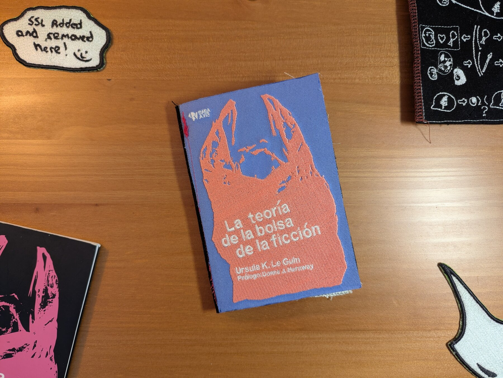
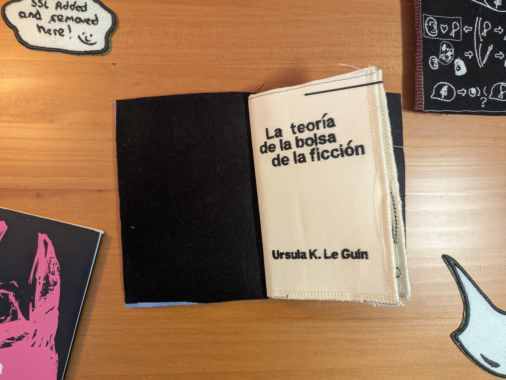
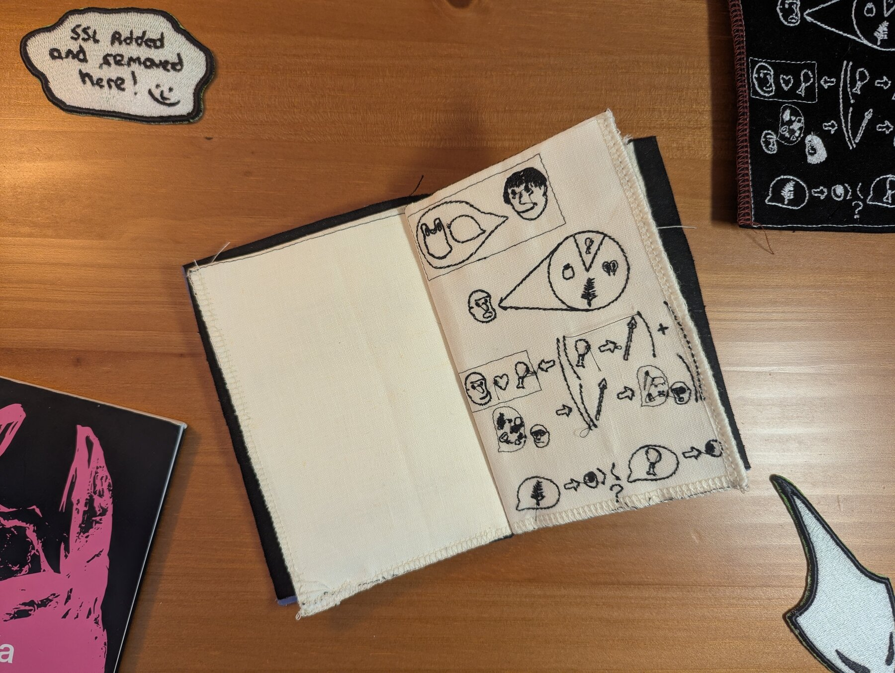
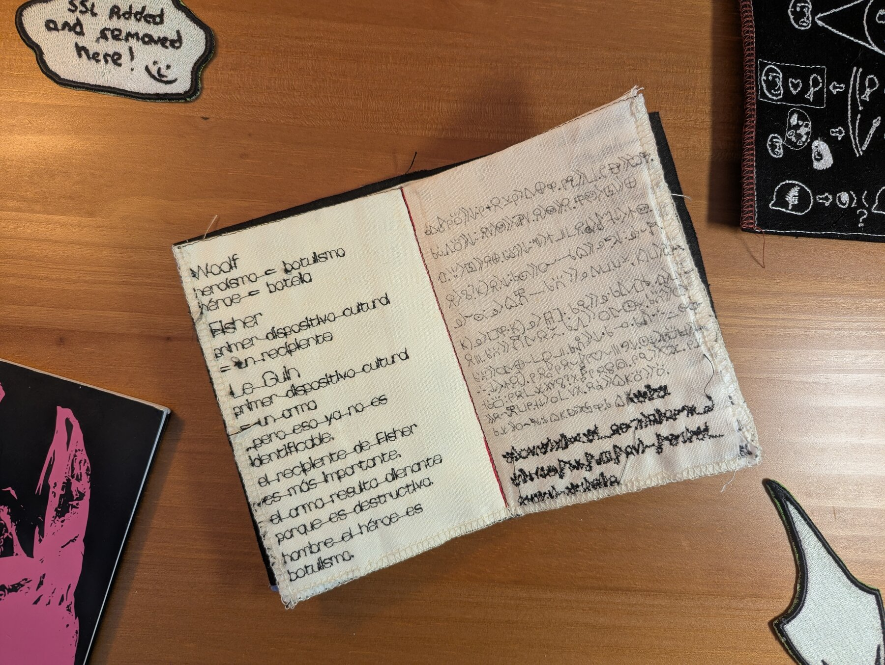
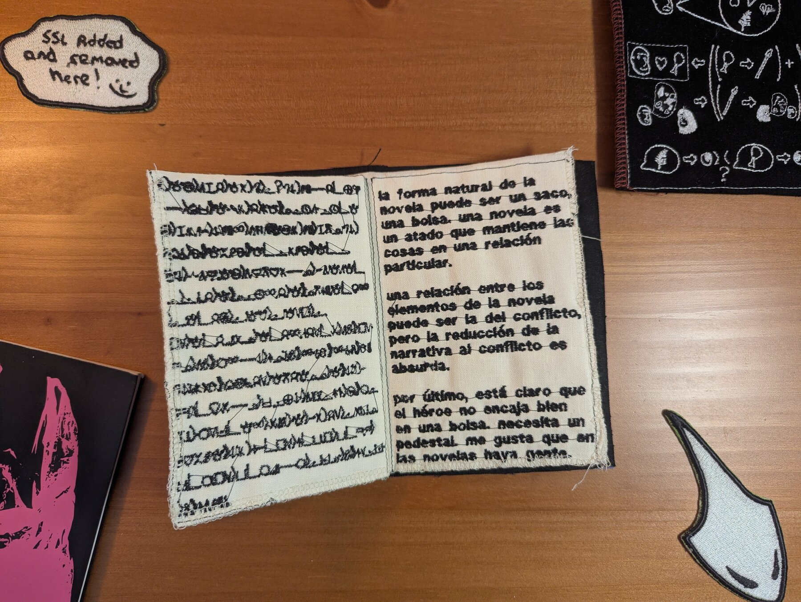
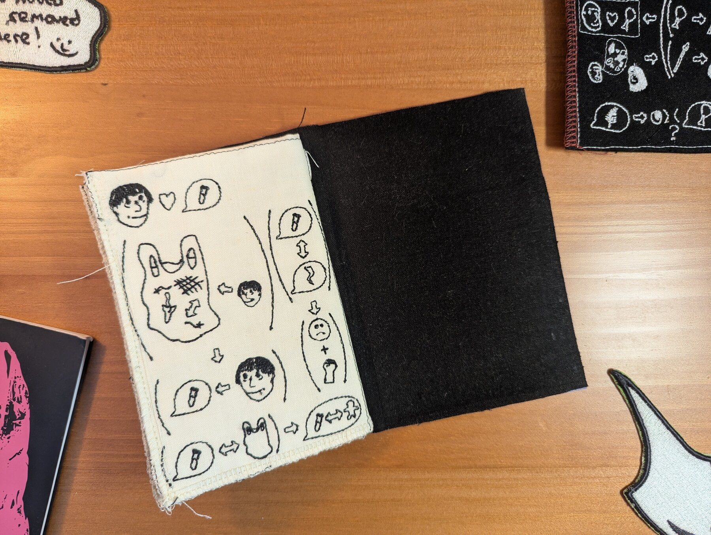

+++
title = "La teoría de la bolsa de ficción"
date = 2026-03-20

[extra]
cover = "PXL_20260424_193954315.jpg"
+++
_medium_: poly patch twill, black and white linen, machine embroidery, serging

The prompt that spurred this project was to take a real-life object that carried
some meaning for me, and to remake it in a way that made it useless or
fundamentally changed its use.

I chose my copy of "La teoría de la bolsa de ficción" for a couple reasons.

The more clear cut one is that it's the first "book" I was able to read cover-
to-cover in Spanish, and I sort of wanted to create a similar experience of
the difficulty reading I had reading it, even if the viewer is a fluent Spanish
speaker.

The other reason is that I bought the book when I was just getting to know my
partner. They're a fluent Spanish speaker and also a LeGuin fan, and I think
probably most of the reason that I bought it was because I wanted to look cool
to her. And so I kind of was thinking that I was also playing on that, because
the embroidered version is obviously this sort of handcrafted piece that looks
very cool, but at the same time is hard to use as a book.

My main goal with the project was to make a physical experience of the object for
other people that aligns with how the object feels to me, and felt to me at that
time.

Along those lines, I wanted the book to still look inviting, even if the
actual content of the book is trying to shut you out.

I chose to do embroidered fabric because I thought that an embroidered version of
the cover would be really eye-catching, and I thought that I would have the technical
competency in embroidery that I would need to pull everything off. The inside of
the book has 8 pages, and covers the full content of the essay from start to finish:

Cover:

1. Title page 
2. Blank
3. Page 1 (pictographs) - talks about the idea of what was so enticing about
meat for early humans and plays through the argument of how meat required
hunting, and hunting created stories. 
4. Page 2 (simplified Spanish) - talks about Virginia Woolf's idea that heroism
is botulism, but the hero is a bottle, and Elizabeth Fisher's concept of the
first cultural device as a recipient (and her carrier bag theory of
evolution).
Makes the start of the argument against the weapon as a primary storytelling agent.
5. Page 3 (toki pona/sitelen pona) - rebuts the weapon argument and expands upon
humanity as taking the things you like back with you (in a
carrier). 
6. Page 4 (toki pona/sitelen pona) - talks about seeking the life story over the
killer story, and starts to talk about the novel as an unheroic story, and how
the proper shape of the novel is perhaps the bag.
7. Page 5 (Spanish) - talks about how the novels keeps relationships in a
certain order, how they might have conflict as a relationship (but not as the
only kind), and how the novel is fundamentally unflattering for
heros. 
8. Page 6 (pictographs) - talks about how Le Guin arrived at science fiction,
and how she took the things in her carrier bag with her. Finally, it talks about
how sci-fi as a mythology of technology is tragic and only leads to conflict,
while sci-fi as the carrier bag shows how science fiction reflects
humanity. 

Choosing how to represent the content of the essay was really difficult. I ultimately
resolved to make it this sort of multi-modal experience because I wanted to be
able to cover the full essay, and I wanted to give the experience of difficulty
to many different kinds of people.
